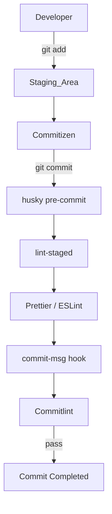

# Dev Workflow Tools

> **Version Compatibility**
>
> - Tested with **husky** v9+, **lint‑staged** v15+, **Commitlint** v19+.
> - Node.js 16 or later is recommended (officially supported).
> - Commitizen and Commitlint are kept in sync via `@commitlint/cz-commitlint`.

## Purpose

This document explains how **husky**, **lint‑staged**, **Prettier**, **ESLint**, **Commitizen**, and **Commitlint** are integrated into the commit workflow so developers can keep clean code and correct commit messages **without breaking their flow**.

### Why do we need them?

- **Quality assurance** — Automatically runs the formatter and static analysis to catch issues before pull requests.
- **Consistency** — Ensures every developer follows the same style and commit conventions, improving readability and maintainability.
- **Automation** — Eliminates manual checks and enhances the developer experience (DX).

## Tool overview and project‑specific purpose

| Tool            | Role / What                                                                                                                                          | Purpose in this project / Why                                                                       |
| --------------- | ---------------------------------------------------------------------------------------------------------------------------------------------------- | --------------------------------------------------------------------------------------------------- |
| **husky**       | Lightweight runtime for managing Git hooks (e.g., `pre-commit`, `commit-msg`). Automatically sets `core.hooksPath` and simplifies hook distribution. | Runs the formatter and linters before each commit and validates commit messages to enforce quality. |
| **lint‑staged** | Utility that runs commands in parallel only on **staged** files.                                                                                     | Executes Prettier and ESLint on the minimum necessary file set to keep commit delays low.           |
| **Prettier**    | Opinionated code formatter with minimal configuration that enforces a consistent style.                                                              | Removes style debates and eliminates whitespace comments in pull‑requests.                          |
| **ESLint**      | Static analysis tool for JavaScript/TypeScript that detects bugs and anti‑patterns.                                                                  | Uses custom and official rules to catch potential bugs before CI.                                   |
| **Commitizen**  | CLI (`git cz` / `pnpm commit`) that generates Conventional Commits messages through an interactive prompt.                                           | Enables developers to create correct commit messages without memorizing the spec.                   |
| **Commitlint**  | Lints commit messages and enforces compliance with Conventional Commits.                                                                             | Blocks non‑conforming commits via the `commit-msg` hook and re‑checks them in CI.                   |

## Tool interaction diagram

### Pre‑commit Hooks (husky + lint‑staged)

Husky’s **`pre-commit`** hook calls `lint‑staged`, which runs **Prettier → ESLint** in that order on staged files only. The hook is automatically set up via the `prepare` script during `pnpm install`.

### Commit Convention (Commitizen + Commitlint)

Developers run `git cz` or `pnpm commit` to create a Conventional Commits message via an interactive prompt. The `commit-msg` hook then verifies the message with Commitlint.

### Formatting & Linting

Running `pnpm format:fix` or `pnpm lint:fix` applies Prettier and ESLint to **all** files.

## Workflow steps (summary)

1. Clone the repository and run `pnpm install` (husky hooks are registered automatically).
2. Modify code and stage changes with `git add`.
3. Create a commit message with `git cz` or `pnpm commit`.
4. During the commit, Prettier, ESLint, and Commitlint run in sequence; if any step fails, the commit is aborted.

## Troubleshooting

- **Git hooks are not running** — Check `git config --get core.hooksPath` and verify that it points to the `.husky` directory.
- **`git cz` fails with `ENOENT`** — Use `pnpm commit` or set an alias: `git config --add alias.cz "!pnpm commit"`.
