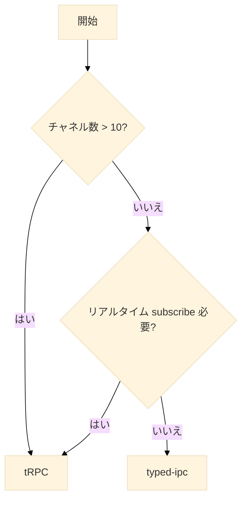

# IPC 型安全実装ガイド

## 1. 導入/概要

このドキュメントは、Electron アプリケーションにおいて Main プロセス, Preload プロセス, Renderer プロセス の 3 プロセス間通信（IPC）を **TypeScript で型安全** に実装するための指針を提供します。  
主に **Electron 開発者および実装を担当する AI Agent** を対象としています。

本書を読むことで、次のゴールを達成できるようになることを目指します。

- tRPC と薄い型付け IPC（typed-ipc）という 2 方式を比較し、要件に合った方式を選定できる
- プロセス境界を越えるデータ構造を 1 か所で管理し、型ずれを防ぐ設計原則を理解できる
- 設定管理 (`config.md`)、永続化 (`storage.md`)、国際化 (`i18n.md`) と連携する IPC レイヤの責務を整理できる citeturn4file1turn4file2turn4file3

## 2. 前提知識

- **分類: Electron 基本**
  - **ライブラリ／ツール:** プロセスモデル — Main・Preload・Renderer の役割と分離
    - 参考リンク: [Process Model](https://www.electronjs.org/docs/latest/tutorial/process-model)
  - **ライブラリ／ツール:** ipcMain / ipcRenderer / contextBridge — プロセス間通信と安全な API 公開
    - 参考リンク: Electron Docs
- **分類: 型安全 RPC**
  - **ライブラリ／ツール:** tRPC — End-to-End 型安全を提供する RPC フレームワーク
    - 参考リンク: <https://trpc.io>
- **分類: 軽量型付け**
  - **ライブラリ／ツール:** @electron-toolkit/typed-ipc — 追加依存ゼロで IPC チャネルを型定義
    - 参考リンク: GitHub
- **分類: 実装言語**
  - **ライブラリ／ツール:** TypeScript 5.x — 静的型付け
    - 参考リンク: TypeScript Docs

## 3. 利用するライブラリ

### 3.1 推奨ライブラリ

- `tRPC Core`
  - npm パッケージ: `@trpc/server`, `@trpc/client`
  - 役割: 型安全 RPC ルーター
  - 選定理由: 大規模・多チャネルに強い
  - 推奨バージョン: ^11.x
- `electron-trpc`
  - npm パッケージ: `electron-trpc`
  - 役割: tRPC を IPC に橋渡し
  - 選定理由: ルーター定義を再利用
  - 推奨バージョン: ^0.7
- `typed-ipc`
  - npm パッケージ: `@electron-toolkit/typed-ipc`
  - 役割: 軽量チャネル型付け
  - 選定理由: 依存最小、学習コスト低
  - 推奨バージョン: ^1.x

### 3.2 利用不可（非推奨）

- `electron.remote`
  - 理由: v14 で削除・セキュリティリスク
  - 代替案: IPC + contextBridge
- `@electron/remote`
  - 理由: remote 復活ラッパー。型安全不可
  - 代替案: typed-ipc / tRPC

## 4. ディレクトリ構造

```text
project-root/
├── electron/
│   ├── main/               # IPC ハンドラ & tRPC ルーター
│   └── preload/            # contextBridge で API 公開
├── src/renderer/            # React など UI
│   └── services/           # window.api.* / trpc.* 呼び出し
├── shared/                  # ipc-schema.ts など 共有型
├── docs/
│   ├── 00_map.md           # ドキュメント一覧
│   ├── 01_ipc.md           # ★ 本書
│   ├── storage.md
│   ├── config.md
│   └── i18n.md
└── package.json
```

## 5. 実装パターン

- **パターン A: typed-ipc**
  - 概要: `invoke/handle` を型付け enum でラップ
  - メリット: 依存小さく導入が容易
  - デメリット: チャネルが増えると管理負荷
- **パターン B: tRPC (electron-trpc)**
  - 概要: ルーター+クライアントを自動生成
  - メリット: 入出力・エラーまで型安全
  - デメリット: 追加依存 (~23 KB)
- **パターン C: ハイブリッド**
  - 概要: 基本は A、複雑 API のみ B
  - メリット: 使い分けで最適化
  - デメリット: 二重構成の学習コスト

パターン選択フロー（簡易）:



## 6. 実装詳細（コードレス要約）

### 6.1 パターン A — typed-ipc

- **設計**: `ipc-schema.ts` にチャネル名と型を union で定義。
- **Main**: `IpcListener/Emitter` が型を検証してハンドラ登録。
- **Preload**: `contextBridge` で `invoke(channel, ...args)` だけを公開。
- **Renderer**: `window.api.invoke('getVersion')` の補完が効く。
- **ユースケース**: 設定値の CRUD (`config.md`) やストレージ操作 (`storage.md`) を呼び出す。
- **テスト**: `tsc --noEmit` で型ずれ検出。

### 6.2 パターン B — tRPC

- **設計**: `appRouter` に `query / mutation / subscription` を宣言。
- **Main**: `createIPCHandler(router)` で一括ハンドラ化。
- **Preload**: `createTRPCProxyClient` を `window.trpc` として expose。
- **Renderer**: `trpc.user.get.query()` など関数呼び出し型で利用。
- **ユースケース**: 外部 Web API の BFF 層や大量チャネルの CRUD。
- **ランタイム**: 中間ミドルウェアでロギング・Zod 検証が可能。

### 6.3 パターン C — ハイブリッド

- 基本設定・永続化 (`storage.md`) は軽量な A。
- 複雑なデータテーブル同期などは B を追加。
- 段階導入によりリスクを分散。

## 7. ドキュメント間の参照方法

- **永続化との連携**: `@/docs/storage.md#5-実装のパターン`
- **設定管理との連携**: `@/docs/config.md#5-実装のパターン`
- **i18n の通知フロー**: `@/docs/i18n.md#6-4-言語切り替え処理`
