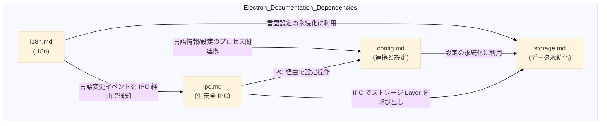

# ドキュメント構成

| ID  | ファイル     | 主題                     | ひと言サマリ                                                            |
| --- | ------------ | ------------------------ | ----------------------------------------------------------------------- |
| 01  | `ipc.md`     | IPC 型安全実装ガイド     | tRPC / typed-IPC 比較、Router 設計、エンドツーエンド型安全を確保        |
| 02  | `storage.md` | データ永続化戦略         | `electron-store / keytar / SQLite` などストレージ層の選定と実装パターン |
| 03  | `config.md`  | プロセス間連携と設定管理 | `ipcMain / contextBridge / electron-store` を使った設定共有パターン     |
| 04  | `i18n.md`    | 国際化（i18n）実装戦略   | `i18next` を中心に言語切替・永続化を設計                                |

## 依存関係図

