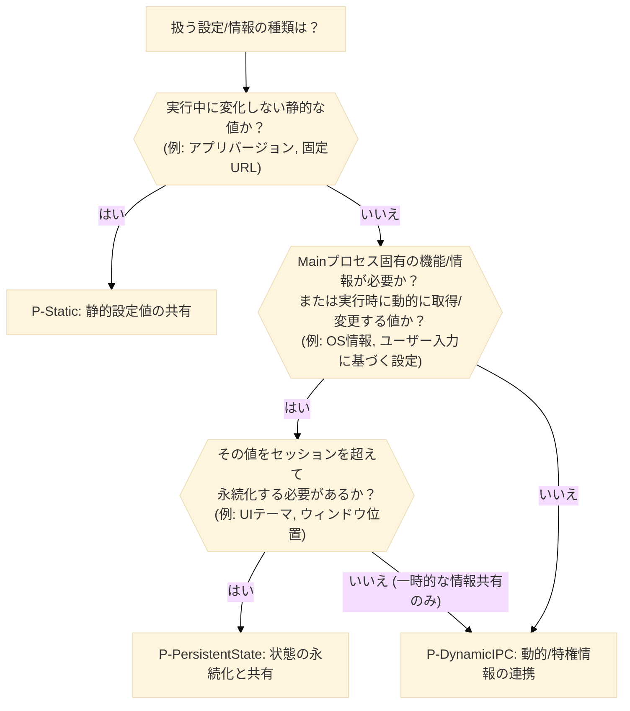
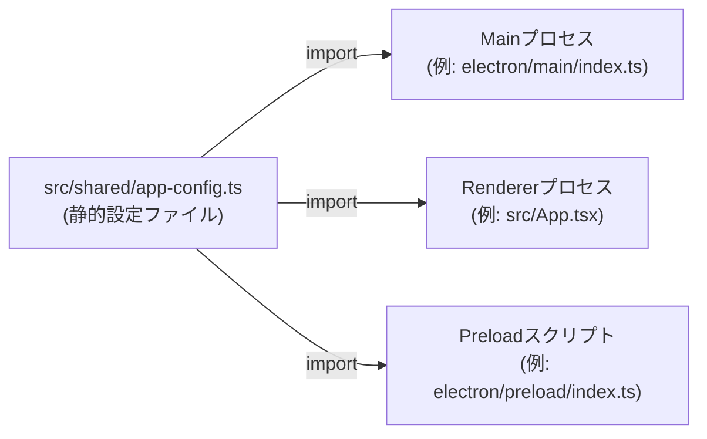
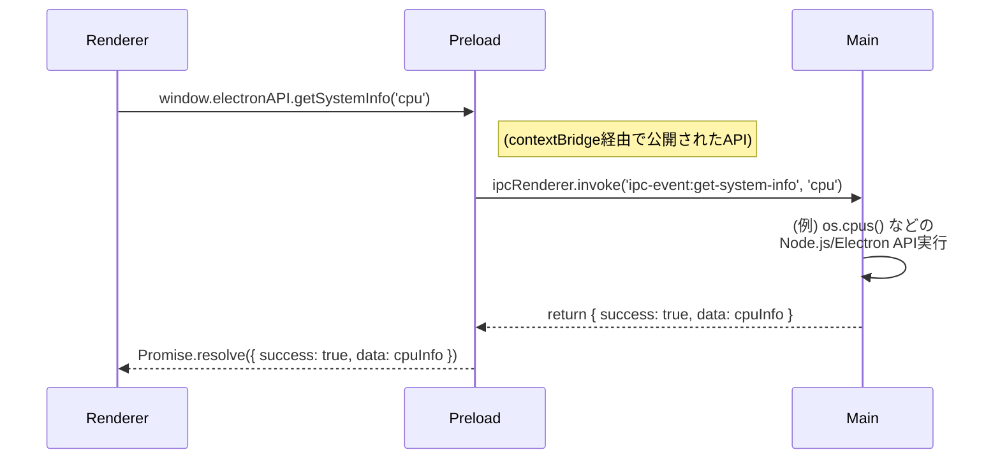
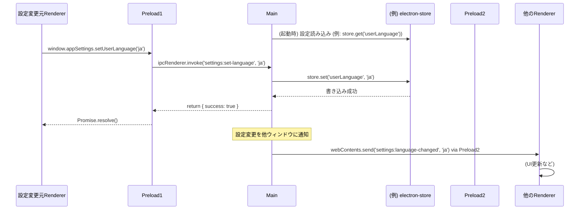

<!-- LLM-TIPS: * Update changelog with o3 with search tool. -->

# Electronプロセス間連携と設定管理

## 1. 導入/概要

このドキュメントは、Electronアプリケーションを構築する上で不可欠な、**Main プロセス, Preload プロセス, Renderer プロセス 間の安全かつ効率的な連携方法**、および**アプリケーション設定値（静的な定数、動的な情報、ユーザー設定など）の管理・共有・永続化**に関するベストプラクティスと実装パターンを解説します。

主に **Electronアプリケーション開発者および実装を担当するAI Agent** を対象としています。

本書を読むことで、以下の内容を理解し、Electronのセキュリティモデル（プロセス分離）を維持しつつ、保守性の高いアプリケーションを設計・実装できるようになることを目指します。

- Electronの主要なプロセス（Main プロセス, Preload プロセス, Renderer プロセス）の役割と、それらの間で安全に通信するための基本原則（プロセス分離、コンテキスト分離）。
- 静的な設定情報をアプリケーション全体で共有する方法。
- Mainプロセスのみが持つ特権情報や動的に変化する値を、Rendererプロセスへ安全に連携させるためのIPCパターン。
- `contextBridge` を利用してPreloadスクリプトから安全にAPIを公開する方法。
- `electron-store` などを利用してアプリケーションの状態（ユーザー設定など）を永続化し、プロセス間で共有する戦略。

関連ドキュメント:

- `@/docs/storage.md` - データ永続化戦略
- `@/docs/i18n.md` - 国際化（多言語対応）

## 2. 前提知識

このドキュメントの内容を完全に理解し、提案されるパターンを効果的に利用するためには、以下の基本的な知識が必要です。

- **分類: Electron基本**
  - **トピック/技術:** プロセスモデル (Main プロセス, Preload プロセス, Renderer プロセス)
    - 説明: Electronアプリケーションの基本的な動作構造、各プロセスの役割と分離。
    - 参考リンク: [Electron Docs: Process Model](https://www.electronjs.org/docs/latest/tutorial/process-model)
  - **トピック/技術:** Preloadスクリプト
    - 説明: Rendererプロセスのグローバルスコープにアクセスできる、特権分離されたスクリプト。
    - 参考リンク: [Electron Docs: Preload Scripts](https://www.electronjs.org/docs/latest/tutorial/preload)
- **分類: JavaScript**
  - **トピック/技術:** 非同期処理 (Promise, async/await)
    - 説明: プロセス間通信は本質的に非同期であるため、これらの理解は不可欠。
    - 参考リンク: [MDN: Promise](https://developer.mozilla.org/ja/docs/Web/JavaScript/Reference/Global_Objects/Promise)
- **分類: Electronセキュリティ**
  - **トピック/技術:** コンテキスト分離 (Context Isolation)
    - 説明: PreloadスクリプトとRendererプロセスのJavaScriptコンテキストを分離する重要なセキュリティ機能。Electron v12以降デフォルトで有効。
    - 参考リンク: [Electron Docs: Context Isolation](https://www.electronjs.org/docs/latest/tutorial/context-isolation)

## 3. 利用するライブラリ

本ドキュメントで解説するパターンでは、主に以下のElectron組込みAPIおよび推奨ライブラリを利用します。

### 3.1 推奨ライブラリ

- `ipcMain` (Electron組込み)
  - npm パッケージ: - (Electronモジュールの一部)
  - 役割: Mainプロセス側で、Rendererプロセスからの非同期メッセージや同期的な要求を受信・処理する。
  - 選定理由: Electronにおけるプロセス間通信の基本的な仕組み。
  - 推奨/最新バージョン: Electron本体のバージョンに依存。
- `ipcRenderer` (Electron組込み)
  - npm パッケージ: - (Electronモジュールの一部)
  - 役割: RendererプロセスやPreloadスクリプトから、Mainプロセスへ非同期メッセージや同期的な要求を送信する。
  - 選定理由: Electronにおけるプロセス間通信の基本的な仕組み。
  - 推奨/最新バージョン: Electron本体のバージョンに依存。
- `contextBridge` (Electron組込み)
  - npm パッケージ: - (Electronモジュールの一部)
  - 役割: PreloadスクリプトからRendererプロセスの `window` オブジェクトへ、安全に特定のAPIや値を公開する。コンテキスト分離を維持する上で不可欠。
  - 選定理由: 安全なIPCのための標準的な方法。
  - 推奨/最新バージョン: Electron本体のバージョンに依存。
- `electron-store`
  - npm パッケージ: `electron-store`
  - 役割: アプリケーション設定やユーザーデータをJSONファイルとして簡単に永続化する。
  - 選定理由: シンプルなAPI、スキーマ検証、マイグレーションサポート。設定の永続化によく利用される。
  - 推奨/最新バージョン: `^8.x` or `^10.x` (v10はESMサポートなど)

### 3.2. 利用に注意が必要なアプローチ・非推奨

- `remote` モジュール (非推奨)
  - 理由・注意点: セキュリティリスクのため、Electron v10で非推奨となり、v14で削除されました。MainプロセスのオブジェクトへRendererから直接アクセスできてしまうため危険。
  - 代替案/推奨: `ipcMain` / `ipcRenderer` を使った明示的なプロセス間通信。
- `nodeIntegration: true`
  - 理由・注意点: RendererプロセスでNode.js APIを直接利用可能にするが、悪意のあるスクリプトがシステムにアクセスするリスクを高める。Electron v5以降デフォルトで`false`。
  - 代替案/推奨: `nodeIntegration: false` (デフォルト) を維持し、必要なNode.js機能はMainプロセスで実行しIPCで連携するか、Preloadスクリプトで安全にラップする。
- `contextIsolation: false`
  - 理由・注意点: PreloadスクリプトとRendererプロセスのJavaScriptコンテキストを共有するため、Preloadで定義したものが汚染されたり、Electron内部APIが漏洩するリスクがある。Electron v12以降デフォルトで`true`。
  - 代替案/推奨: `contextIsolation: true` (デフォルト) を維持し、`contextBridge` を使用してAPIを公開する。

---

## 4. ディレクトリ構造

本ドキュメントで解説する設定管理やプロセス間連携に関連するコードは、一般的に以下のようなディレクトリ構造で配置されることを想定しています。

```text
project-root/
├── src/                         # Source root shared by all processes
│   ├── main/                   # Main process code
│   │   ├── index.ts           # App entry, creates BrowserWindow
│   │   ├── ipcHandlers.ts     # ipcMain handlers are grouped here
│   │   └── configManager.ts   # electron‑store & runtime‑config logic
│   ├── preload/                # Preload scripts (contextBridge)
│   │   ├── index.ts            # Exposes secure APIs to Renderer
│   │   └── index.d.ts          # Type definitions for exposed APIs
│   ├── renderer/               # Renderer (React, UI) code
│   │   ├── services/           # Service layer wrapping IPC calls
│   │   │   └── settingsAPI.ts  # Calls to Preload‑exposed APIs
│   │   └── components/         # React components, hooks, etc.
│   └── shared/                 # Code & types reused across processes
│       ├── app-config.ts      # Static constants
│       └── types.ts           # Shared type definitions
├── locales/                    # Translation resources (see 04_i18n.md)
├── docs/                       # Project documentation
│   ├── 03_config.md
│   └── 04_i18n.md
```

---

## 5. 実装のパターン

アプリケーションの設定や情報をプロセス間で扱うための主要なパターンを紹介します。

- **パターンID: P-Static**
  - パターン名: 静的設定値の共有
  - 概要: アプリケーションのビルド時に決定され、実行中に変化しない静的な定数（例: デフォルト言語、APIのベースURL、固定のパス部分など）を、複数のプロセスで共有します。
  - メリット: 実装がシンプル。IPC通信が不要なためオーバーヘッドがない。型安全性を確保しやすい。
  - デメリット: 実行時の動的な変更はできない。機密情報（APIキーなど）の直接的なハードコーディングには不向き。
- **パターンID: P-DynamicIPC**
  - パターン名: 動的/特権情報の連携 (IPC経由)
  - 概要: Mainプロセスのみがアクセスできる情報（OS情報、ファイルシステム情報、計算結果など）や、実行中に変化する可能性のある情報を、IPCとPreloadスクリプトを介してRendererプロセスへ安全に連携します。
  - メリット: プロセス分離を維持しつつ安全に情報共有が可能。柔軟性が高い。OS固有機能へのアクセスを提供できる。
  - デメリット: IPC通信のための定型的なコード（ハンドラ、API公開）が必要。非同期処理の管理が伴う。
- **パターンID: P-PersistentState**
  - パターン名: 状態の永続化と共有 (ストレージ + IPC)
  - 概要: ユーザーが選択した設定（テーマ、ウィンドウサイズ、言語など）やアプリケーションの状態をファイルに保存し、セッションを超えて維持します。これらの永続化された設定はIPCを通じて各プロセスで利用・更新されます。
  - メリット: ユーザー体験の向上（前回の状態を復元）。複数ウィンドウ間での設定同期。
  - デメリット: ファイルI/Oの考慮（パフォーマンス、エラーハンドリング）。IPCによる状態管理の複雑性が増す場合がある。

パターン選択フロー:



## 6. 実装詳細

### 6.1. パターン P-Static — 静的設定値の共有

#### 6.1.1. データフロー（概念図）

このパターンでは、直接的なプロセス間「通信」によるデータフローは発生しません。ビルドプロセスやモジュール解決を通じて、各プロセスが共有された設定ファイル（モジュール）を個別にインポートして利用します。



#### 6.1.2. コード提案の方針

このパターンでは、TypeScriptファイル（例: `src/shared/app-config.ts`）を作成し、そこに `export const` 形式で静的な設定値を定義します。ビルドツール（Viteなど）でパスエイリアス（例: `@shared`）を設定すると、Mainプロセス、Rendererプロセス、Preloadスクリプトのそれぞれから簡単にこの共有ファイルをインポートできます。
具体的な実装は、上記の方針および下記のエラーハンドリング・ベストプラクティスを参考にLLMが生成します。

#### 6.1.3. エラーハンドリング & ベストプラクティス

- **単一の情報源 (Single Source of Truth):** 設定値を一箇所で管理することで、変更時の修正漏れや不整合を防ぎます (DRY原則)。
- **パスの扱いに注意:** 共有モジュール内でファイルシステムパスを定義する場合、それは相対パスや識別子に留め、実行時の絶対パス解決はMainプロセス側で行うべきです（例: `app.getAppPath()` と結合）。`@/docs/01_storage.md#4-ディレクトリ構造` も参照。
- **環境依存コードの回避:** 共有モジュール内では、特定のプロセス環境（Node.js APIやブラウザAPI）に依存するコードは記述せず、単純な定数、型定義、純粋な関数に限定するのが安全です。
- **ビルド設定:** TypeScriptのトランスパイル設定やパスエイリアス設定が、MainプロセスとRendererプロセスの両方で正しく機能するようにビルドツール（Viteなど）を設定します。

### 6.2. パターン P-DynamicIPC — 動的/特権情報の連携 (IPC経由)

#### 6.2.1. データフロー

RendererプロセスがPreloadスクリプト経由で公開されたAPIを呼び出し、Preloadスクリプトが`ipcRenderer.invoke`でMainプロセスに対応するハンドラを要求します。Mainプロセスは処理を行い結果を返し、それがRendererプロセスへPromiseとして解決されます。



#### 6.2.2. コード提案の方針

このパターンでは、Mainプロセスに `ipcMain.handle(channel, handler)` を用いて特定のチャネルに対するリクエストハンドラを登録します。Preloadスクリプトでは `contextBridge.exposeInMainWorld(apiKey, apiObject)` を使用し、Rendererプロセスから安全に呼び出せる関数群（APIオブジェクト）を `window` オブジェクトに公開します。この公開された関数は内部で `ipcRenderer.invoke(channel, ...args)` を呼び出してMainプロセスのハンドラと通信します。
具体的な実装は、上記のデータフロー図および下記のエラーハンドリング・ベストプラクティスを参考にLLMが生成します。

#### 6.2.3. エラーハンドリング & ベストプラクティス

- **コンテキスト分離の遵守:** `contextIsolation: true` (デフォルト) を前提とし、必ず `contextBridge` を使用してAPIを公開します。これにより、Rendererプロセスが悪意のある操作を行うリスクを低減します。
- **最小権限の原則:** Preloadスクリプトで公開するAPIは、Rendererプロセスが必要とする機能のみに限定します。ElectronやNode.jsの強力なAPIを直接公開しないでください。
- **入力値の検証:** Mainプロセスのハンドラでは、Rendererプロセスから渡された引数（チャネル名やデータ）を検証することを検討してください。
- **エラー伝達:** `ipcMain.handle` のハンドラ内でエラーが発生した場合、`try...catch` で捕捉し、エラー情報を含むオブジェクトを返すか、エラーをスローして `invoke` のPromiseをrejectさせます。Renderer側ではPromiseの `catch` 節でエラーを処理します。
- **非同期メッセージ (一方向通知):** 要求/応答 (`invoke`/`handle`) だけでなく、MainからRendererへの一方向の通知には `webContents.send(channel, ...args)` と `ipcRenderer.on(channel, listener)` の組み合わせも利用できます。

### 6.3. パターン P-PersistentState — 状態の永続化と共有 (ストレージ + IPC)

#### 6.3.1. データフロー

設定値の読み書きはP-DynamicIPCパターンと同様にIPC経由で行われますが、Mainプロセスはリクエストに応じて `electron-store` などの永続化ライブラリと対話し、ファイルシステム上のデータを操作します。設定変更時には、他の開いているウィンドウに変更を通知することも考慮します。



#### 6.3.2. コード提案の方針

このパターンでは、Mainプロセスで `electron-store` のインスタンスを作成・初期化します。設定値の取得 (`store.get`) と設定 (`store.set`) を行うためのIPCハンドラ (`ipcMain.handle`) を定義します。P-DynamicIPCパターンと同様に、Preloadスクリプト経由でこれらの機能をRendererプロセスにAPIとして提供します。さらに、設定が変更された際に `BrowserWindow.getAllWindows().forEach(win => win.webContents.send(...))` を用いて、開いている他の全てのウィンドウに変更を通知する仕組みを実装します。
具体的な実装は、上記のデータフロー図および下記のエラーハンドリング・ベストプラクティスを参考にLLMが生成します。

#### 6.3.3. エラーハンドリング & ベストプラクティス

- **`electron-store` の利用:**
  - **スキーマ定義:** `schema` オプションで設定値の型や構造を定義し、予期せぬデータ混入を防ぎます。
  - **デフォルト値:** `defaults` オプションで、設定ファイルが存在しない場合や特定のキーがない場合の初期値を設定します。
  - **マイグレーション:** アプリのバージョンアップで設定構造が変更になる場合、`migrations` オプションで古い設定から新しい設定への移行ロジックを記述できます。
  - 詳細は `@/docs/storage.md#61-パターン-p1--electron-store-による設定情報の永続化` も参照。
- **スレッドセーフティ:** `electron-store` はファイル書き込みをアトミックに行うため、ある程度の安全性はありますが、複数のプロセスから極端に頻繁に同時書き込みするような設計は避けるべきです。通常はMainプロセスが一元管理します。
- **変更通知の粒度:** 全てのウィンドウに無差別に通知するのではなく、関心のあるウィンドウや特定の条件に基づいて通知対象を絞ることも検討できます。
- **設定UIの即時反映:** Rendererプロセスは設定変更APIを呼び出した後、成功応答を待ってからUIを更新するか、楽観的UI更新（即時更新し、失敗したらロールバック）を行うかを検討します。Mainプロセスからの変更通知イベントを受け取ってUIを更新するパターンも重要です。

#### 6.4. 組み合わせ例と基本原則の再確認

上記パターンはしばしば組み合わせて利用されます。

- **例1: アプリケーション起動時の初期言語設定** (`@/docs/i18n.md` と関連)
  1. Mainプロセス: `electron-store` (P-PersistentState) から保存されたユーザー言語を取得。なければOSの言語 (P-DynamicIPC) やデフォルト言語 (P-Static) をフォールバックとして使用。
  2. Mainプロセス: 決定した初期言語を、ウィンドウ作成時にRendererへ渡すか、専用のIPCチャネルで通知。
- **例2: ユーザーによる言語変更**
  1. Renderer: UI操作で言語を選択。
  2. Renderer: IPC (P-DynamicIPC) 経由でMainプロセスに選択言語を通知。
  3. Mainプロセス: `electron-store` (P-PersistentState) に新言語を保存。他のウィンドウに変更を通知 (P-DynamicIPCの一方向通知)。
  4. 各Renderer: 通知を受け取りUIを更新。

**基本原則の遵守:**

- **プロセス分離:** RendererプロセスからNode.js APIやファイルシステムへ直接アクセスさせない。必要な機能はMainプロセスで処理し、IPCで結果のみを渡す。
- **コンテキスト分離:** `contextBridge` を常に使用し、Preloadスクリプトの安全性を確保する。
- **単一の情報源:** 特に静的設定は一箇所で定義し、共有する。動的な状態もMainプロセスが権威を持つなど、情報源を明確にする。
