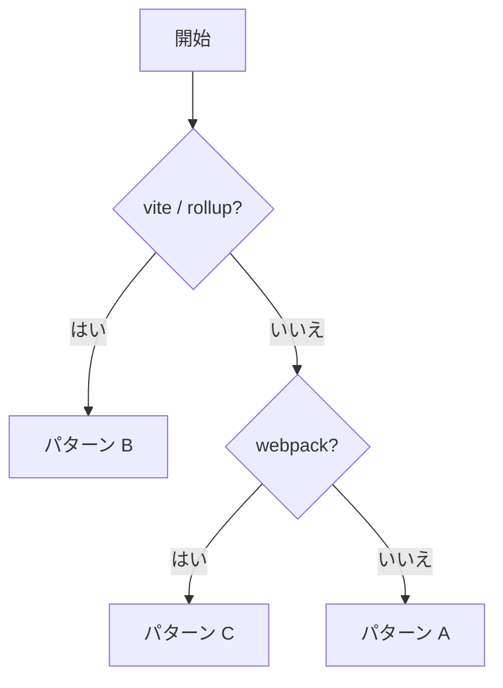

# Electronライセンス表示ガイド

## 1. 導入/概要

このドキュメントは、Electron アプリの **Help ▸ Licenses** から常に最新の OSS ライセンス全文を閲覧できる機能を **完全自動** で実装・運用するための指針を提供します。対象読者は **Electron アプリ開発者** および **CI/CD 担当者** です。

読了後に可能になること:

- electron-vite のビルド時にライセンスファイルを自動生成する
- electron-builder で生成物を同梱し、インストーラの規約画面にも反映する
- GitHub Actions で禁止ライセンスを門前払いし、ビルド & リリースを自動化する

## 2. 前提知識

- **ライブラリ／ツール:** `license-checker-rseidelsohn` — 元 `license-checker` のメンテナンスフォークで現在もリリース継続。`node_modules` を走査して SPDX ライセンス文字列と全文を取得
- **ライブラリ／ツール:** `rollup-plugin-license` — Rollup のバンドルに含まれる依存のみを解析し `ThirdPartyNotices.txt` を出力
- **ライブラリ／ツール:** `license-webpack-plugin` — Webpack 用。バンドルごとにライセンスファイルやバナーを挿入
- **CI ツール:** `license-checker-action` — GitHub Actions 上で `license-checker` を実行し、ホワイトリスト外ライセンスでジョブを失敗させる

## 3. 利用するライブラリ

### 3.1. 利用可能ライブラリ

| ライブラリ                  | 役割                                                              | 推奨バージョン |
| --------------------------- | ----------------------------------------------------------------- | -------------- |
| license-checker-rseidelsohn | CLI でライセンス全文を HTML/JSON/TXT に書き出す (maintained fork) | ^4.x           |
| rollup-plugin-license       | electron-vite と組み合わせ、バンドル済み依存のみを抽出            | ^3.x           |
| license-checker-action      | CI で禁止ライセンス混入を検知                                     | latest         |

### 3.2. 利用不可ライブラリ

| ライブラリ                | 理由                                 | 代替                        |
| ------------------------- | ------------------------------------ | --------------------------- |
| license-checker           | 最終リリースが2019年と古くメンテ停止 | license-checker-rseidelsohn |
| license-report            | メンテ停止・Node18 で警告            | license-checker             |
| oss-attribution-generator | GUI 前提で CI と親和性が低い         | rollup-plugin-license       |

## 4. ディレクトリ構造

```text
project-root/
├── src/
│   ├── main/
│   ├── preload/
│   └── renderer/
├── resources/              # 生成された licenses.html / txt
├── docs/research/
│   └── electron-license-display.md   # ← 本書
└── .github/workflows/      # GitHub Action 定義
```

## 5. 実装パターン

| パターン                             | 特徴                     | 長所                              | 短所                             |
| ------------------------------------ | ------------------------ | --------------------------------- | -------------------------------- |
| A: CLI (license-checker-rseidelsohn) | postinstall で HTML 生成 | 設定ゼロで簡単                    | すべての依存を列挙し冗長         |
| B: Rollup プラグイン                 | rollup-plugin-license    | tree‑shaking 後の依存のみ         | external/native は漏れる         |
| C: Webpack プラグイン                | license-webpack-plugin   | Webpack プロジェクトに 1 行で導入 | electron-vite では Renderer 限定 |

### 選択フロー



## 6. 実装詳細

### 6.1. パターン A — CLI 生成

```bash
npm i -D license-checker-rseidelsohn
```

`package.json`:

```jsonc
{
  "scripts": {
    "generate-licenses": "license-checker-rseidelsohn --html resources/licenses.html",
    "postinstall": "npm run generate-licenses",
  },
}
```

electron-builder 設定:

```yaml
extraResources:
  - from: "resources/licenses.html"
    to: "licenses.html"
```

Main プロセスでメニュー:

```ts
Menu.setApplicationMenu(
  Menu.buildFromTemplate([
    {
      label: "Help",
      submenu: [
        {
          label: "Licenses",
          click: () => {
            const win = new BrowserWindow({ title: "Open-Source Licenses" });
            win.loadFile(path.join(process.resourcesPath, "licenses.html"));
          },
        },
      ],
    },
  ]),
);
```

CI 例:

```yaml
jobs:
  license-gate:
    runs-on: ubuntu-latest
    steps:
      - uses: actions/checkout@v3
      - run: npm ci
      - run: npx license-checker-rseidelsohn --onlyAllow "MIT;Apache-2.0;BSD-3-Clause"
```

### 6.2. パターン B — Rollup プラグイン

```ts
import license from "rollup-plugin-license";
export default defineConfig({
  main: {
    rollupOptions: {
      plugins: [
        license({
          output: "resources/ThirdPartyNotices.txt",
          thirdParty: { includePrivate: true },
        }),
      ],
    },
  },
});
```

`afterPack` 例:

```js
"build": {
  "afterPack": "cp resources/ThirdPartyNotices.txt $APP_OUT_DIR/licenses.txt"
}
```

## 7. 参考リンク

- license-checker-rseidelsohn: <https://github.com/RSeidelsohn/license-checker-rseidelsohn>
- rollup-plugin-license: <https://github.com/mjeanroy/rollup-plugin-license>
- license-checker-action: <https://github.com/steffen911/license-checker-action>
