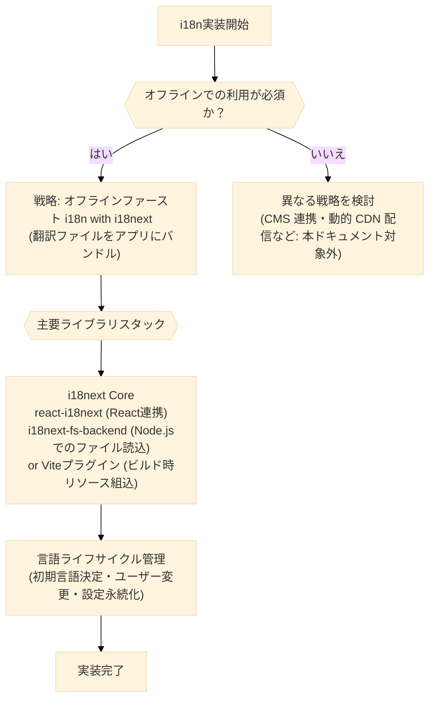
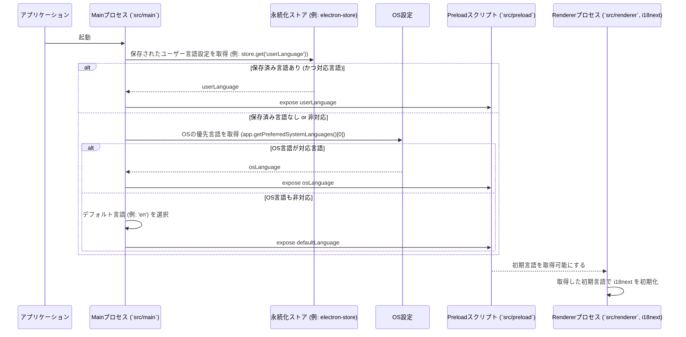
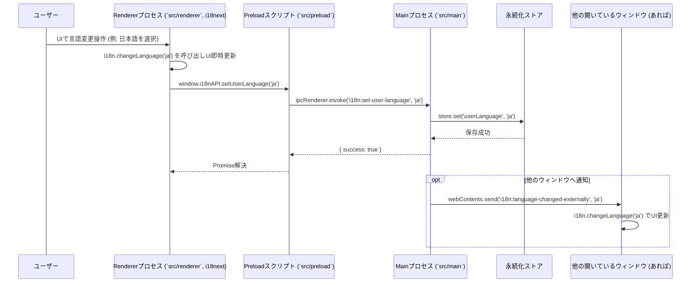

<!-- LLM-TIPS: * Update changelog with o3 with search tool. -->

# Electron国際化(i18n)実装戦略

## 1. 導入/概要

このドキュメントは、`electron-vite`、TypeScript、React を使用したElectronアプリケーションにおける国際化（i18n、多言語対応）の実装方針、使用する主要ライブラリ、および具体的な設定・連携手順について解説します。
主に **Electronアプリケーション開発者および実装を担当するAI Agent** を対象としています。

本書を読むことで、以下の内容を理解し、オフラインファーストな多言語対応機能をアプリケーションに組み込むことができるようになることを目指します。

- `i18next` を中心としたライブラリスタックの選定理由と役割。
- オフラインファーストを実現するための翻訳ファイルの管理とバンドル戦略。
- Electronのプロセスモデル（Main プロセス, Preload プロセス, Renderer プロセス）における `i18next` の設定とデータの流れ。
- 初期言語の決定ロジック、ユーザーによる言語切り替え、および設定の永続化方法。
- 翻訳キーの抽出や翻訳作業のワークフローに関する基本的な考え方。

関連ドキュメント:

- `@/docs/config.md` - プロセス間連携と設定管理 (言語設定の永続化やIPC連携に不可欠)
- `@/docs/storage.md` - データ永続化戦略 (言語設定の保存に `electron-store` を利用する場合など)

---

## 2. 前提知識

このドキュメントの内容を効果的に理解し活用するためには、以下の基本的な知識が必要です。

- **分類: Electron基本**
  - **トピック/技術:** プロセスモデル (Main プロセス, Preload プロセス, Renderer プロセス)
    - 説明: Electronアプリケーションの動作構造、各プロセスの役割と分離。
    - 参考リンク: `@/docs/config.md#2-前提知識` および [Electron Docs: Process Model](https://www.electronjs.org/docs/latest/tutorial/process-model)
  - **トピック/技術:** IPC (プロセス間通信) と `contextBridge`
    - 説明: プロセス間で安全にデータをやり取りする仕組みと、PreloadスクリプトからAPIを公開する方法。
    - 参考リンク: `@/docs/config.md#3-利用する主要apiとライブラリ`
- **分類: フロントエンド技術**
  - **トピック/技術:** React (フック、コンポーネント)
    - 説明: UI構築のための基本的なReactの知識。
    - 参考リンク: [React Docs](https://react.dev/)
  - **トピック/技術:** TypeScript
    - 説明: 型システムに関する基本的な理解。
- **分類: 国際化 (i18n) 一般**
  - **トピック/技術:** `i18next` の基本概念
    - 説明: `i18next` が提供する主な機能（言語検出、リソース読み込み、補間、複数形処理など）の概要。
    - 参考リンク: [i18next Documentation](https://www.i18next.com/)

---

## 3. 利用するライブラリ

本ドキュメントで解説する国際化戦略では、以下の主要なライブラリおよびElectron APIを利用します。

### 3.1 推奨ライブラリ

- `i18next`
  - npm パッケージ: `i18next`
  - 役割: 国際化機能のコアライブラリ。言語検出、翻訳リソースの読み込み・キャッシュ、テキスト補間、複数形処理など、豊富な機能を提供。
  - 選定理由: デファクトスタンダードであり、エコシステムが充実。柔軟な設定が可能。
  - 推奨/最新バージョン: `^23.x`
- `react-i18next`
  - npm パッケージ: `react-i18next`
  - 役割: `i18next` をReactアプリケーションで容易に利用するためのバインディング。`useTranslation` フックや `Trans` コンポーネントを提供。
  - 選定理由: `i18next` 公式のReact連携ライブラリであり、Reactの流儀に沿った実装が可能。
  - 推奨/最新バージョン: `^13.x` or `^14.x`
- `i18next-fs-backend`
  - npm パッケージ: `i18next-fs-backend`
  - 役割: Node.js環境（ElectronのMainプロセスやPreloadスクリプトなど、Node.js APIが利用可能な環境）で、ファイルシステムから翻訳ファイルを非同期に読み込むためのバックエンドプラグイン。
  - 選定理由: オフラインファースト方針に基づき、アプリケーションにバンドルされた `locales` ディレクトリから直接翻訳ファイルを読み込むために必要。
  - 注意点:
    - Rendererプロセスで `nodeIntegration: false` (デフォルト) の場合、このバックエンドは直接利用できません。Preloadスクリプトで初期化し `contextBridge` で結果を渡すか、MainプロセスにIPCで読み込みを依頼するなどの対策が必要です。
    - PreloadスクリプトでNode.js API (例: `fs`) を利用するには、BrowserWindow作成時に `webPreferences.sandbox: false` の設定が必要になる場合があります (Electron 20+)。ただし、セキュリティリスクを慎重に評価してください。`contextIsolation: true` (デフォルト) は維持します。
  - 推奨/最新バージョン: `^2.x`
- `vite-plugin-i18next-loader` (Vite利用時)
  - npm パッケージ: (例: `vite-plugin-i18next-loader` や類似のViteプラグイン)
  - 役割: Viteのビルドプロセスで、`locales` ディレクトリ内の翻訳ファイルをJSONリソースとして直接バンドルする、または動的インポート可能な形に変換する。`i18next-fs-backend` の代替としてRenderer側で完結させる場合に有用。
  - 選定理由: `i18next-fs-backend` のようなNode.js依存のバックエンドをPreload/Mainで使いたくない場合や、よりビルド時に最適化したい場合に選択。
- `app.getPreferredSystemLanguages()` (Electron API)
  - npm パッケージ: - (Electronモジュールの一部)
  - 役割: Mainプロセスで、OSの優先言語リストを取得する。初期言語の決定に利用。
  - 選定理由: ElectronネイティブAPIであり、外部ライブラリへの依存を減らせる。
  - 注意点: Electron v21.3以降で利用可能。旧バージョンでは `app.getLocale()` をフォールバックとして使用。
- `i18next-browser-languagedetector`
  - npm パッケージ: `i18next-browser-languagedetector`
  - 役割: Rendererプロセスで、ブラウザの言語設定（`navigator.language`）、クエリパラメータ、Cookie、`localStorage` などから言語を検出する。
  - 選定理由: `app.getPreferredSystemLanguages()` の結果をMainから受け取るまでのフォールバックや、Web的な言語検出方法と組み合わせる場合に有用。
- `i18next-parser`
  - npm パッケージ: `i18next-parser`
  - 役割: ソースコード（JS, TS, JSX, TSXなど）を静的解析し、使用されている翻訳キーを抽出して翻訳ファイル（JSONなど）の雛形を生成・更新する。
  - 選定理由: 翻訳キーの管理を自動化し、抜け漏れを防ぐ。CIやpre-commitフックでの利用を推奨。

### 3.2. 利用不可ライブラリ (非推奨)

- `i18next-node-fs-backend`
  - 理由: `i18next-fs-backend` がより新しく、メンテナンスも活発であるため。
  - 代替案: `i18next-fs-backend`
- `i18next-electron-language-detector`
  - 理由: ElectronネイティブAPI (`app.getPreferredSystemLanguages`, `app.getLocale`) をMainプロセスで利用し、IPC経由でRendererに渡す方が、外部ライブラリへの依存を減らせるため。詳細は `@/docs/config.md` 参照。
  - 代替案: ElectronネイティブAPI + IPC
- `i18next-electron-fs-backend`
  - 理由: メンテナンスが限定的であり、`i18next-fs-backend` をPreloadスクリプトで安全に（またはIPC経由でMainプロセスに委譲して）利用可能であるため不要。
  - 代替案: `i18next-fs-backend` + IPC または Preloadでの安全な利用

## 4. ディレクトリ構造

国際化に関連する主要なファイルは、以下の場所に配置されることを想定しています。

```text
project-root/
├── locales/                       # 翻訳ファイル格納場所 (このパスは設定で変更可能)
│   ├── en/
│   │   └── translation.json     # 英語の翻訳 (デフォルト名前空間)
│   └── ja/
│       └── translation.json      # 日本語の翻訳
├── src/                           # ソースコードルート
│   ├── main/                     # Mainプロセス関連
│   │   ├── index.ts             # Mainプロセスのエントリーポイント
│   │   └── i18nManager.ts       # (例) i18n関連のMainプロセスロジック
│   ├── preload/                  # Preloadスクリプト関連
│   │   ├── index.ts             # 主要なPreloadスクリプト
│   │   └── index.d.ts           # Preload APIの型定義
│   ├── renderer/                 # Rendererプロセス (Reactなど)
│   │   ├── i18n/                # i18n設定関連ファイル (Renderer側)
│   │   │   └── index.ts        # i18nextの初期化設定 (この場所を推奨)
│   │   ├── App.tsx              # Reactアプリルート
│   │   └── components/          # Reactコンポーネント (翻訳機能を利用)
│   └── shared/                   # Main/Preload/Renderer間で共有するコード
│       └── i18nConstants.ts      # (例) 対応言語リスト、デフォルト言語など
├── docs/
│   └── 03_i18n.md                # このドキュメント
└── package.json
```

## 5. 実装の基本方針 (戦略)

本アプリケーションにおける国際化は、以下の基本方針（戦略）に基づき実装します。

- **戦略名: オフラインファーストi18n with `i18next`**
  - **概要:**
    - アプリケーションはオフライン環境でも利用可能であるため、翻訳リソース（言語ファイル）はネットワーク接続なしでアクセス可能である必要があります。これを実現するため、翻訳データ（JSON形式）はプロジェクトルート直下の `locales` ディレクトリに言語ごとに配置し（例: `locales/en/translation.json`）、ビルドプロセスでアプリケーションパッケージに含めます。
    - 翻訳内容の更新は、アプリケーション自体のバージョンアップ時に行います。実行中にオンラインで動的に言語ファイルを取得・更新する機能や、ユーザーが後から個別に追加言語パックをインストールする機能は、本方針では実装しません。
    - アプリケーション起動時に、利用可能性のある全ての言語データをメモリにロードします（言語数が非常に多い場合は遅延ロードを検討）。開発環境では `i18next.reloadResources()` と `watch` オプションにより翻訳ファイルのホットリロードが可能です。
  - **メリット:** オフラインでの完全な機能提供。標準的で強力な `i18next` エコシステムの活用。Reactとの親和性が高い。
  - **デメリット:** アプリケーションのバージョンアップなしに翻訳のみを更新することはできない。全言語データを初期ロードする場合、言語数が多いと初期メモリ消費が増加する可能性（遅延ロードで対応可）。

戦略選択フロー（本ドキュメントでは上記戦略を主軸とします）:



## 6. 実装詳細

### 6.1. `i18next` の初期設定 (Rendererプロセス: `src/renderer/i18n/index.ts`)

#### 6.1.1. データフローと連携

Rendererプロセスで `i18next` を初期化する際、以下の情報がMainプロセスやPreloadスクリプトから連携される必要があります。

1.  **初期言語 (`lng` オプション):** Mainプロセス (`src/main/i18nManager.ts` など) がユーザーの保存設定やOS設定から決定し、Preloadスクリプト (`src/preload/index.ts`) 経由でRendererに渡します。
2.  **翻訳ファイルのパス (`backend.loadPath` オプション for `i18next-fs-backend`):** Mainプロセスが `locales` ディレクトリの絶対パスを解決し、Preload経由でRendererに渡します。 (Viteプラグインでリソースを直接インポートする場合はこのパス解決は不要な場合もあります)

詳細は `@/docs/config.md` のプロセス間連携パターンを参照してください。

#### 6.1.2. コード提案の方針

`src/renderer/i18n/index.ts` (または同様のファイル) で `i18next` インスタンスを作成し、`.use()` でプラグイン (例: `Backend`, `LanguageDetector`, `initReactI18next`) を追加し、`.init()` で設定を適用します。
`.init()` の主な設定項目:

- `fallbackLng`: フォールバック言語 (例: 'en')。
- `interpolation.escapeValue`: Reactでは通常 `false` (XSS対策はReactが行うため)。
- `debug`: 開発時に `true` にするとデバッグログが出力される。
- `lng`: 初期表示言語。Preload経由で取得した値を設定。
- `backend.loadPath`: `i18next-fs-backend` を使用する場合の翻訳ファイルのパス。Preload経由で取得した値を元に `{{lng}}/{{ns}}.json` のような形式で指定。
- `resources`: `i18next-fs-backend` を使わず、ビルド時に翻訳リソースを直接埋め込む場合の指定方法。
  具体的な実装は、上記の方針および下記のエラーハンドリング・ベストプラクティスを参考にLLMが生成します。

#### 6.1.3. エラーハンドリング & ベストプラクティス

- **初期言語の取得失敗:** Preload経由での初期言語取得に失敗した場合のフォールバック処理を考慮します (`lng`が未指定なら`fallbackLng`が使われる)。
- **翻訳ファイルの読み込み失敗:** `loadPath` が不正、またはファイルが存在しない場合のエラーを考慮します (`i18next` は警告を出すか、`fallbackLng` を使用します)。
- **`supportedLngs` オプション:** 対応する言語のリストを明示的に指定することで、予期しない言語コードによる問題を避けることができます（例: `src/shared/i18nConstants.ts` で定義）。
- **`ns` (名前空間) オプション:** 翻訳ファイルを機能ごとなどに分割する場合に利用します。デフォルトは `translation`。

### 6.2. 初期言語の決定と永続化 (Mainプロセス中心)

#### 6.2.1. データフロー (言語ライフサイクル - 初期化)

アプリケーション起動時の初期言語は以下の優先順位で決定され、その結果がRendererプロセスの `i18next` 初期化に利用されます。



#### 6.2.2. コード提案の方針

**Mainプロセス (`src/main/i18nManager.ts` または `src/main/index.ts` 内):**

- `SUPPORTED_LOCALES` 配列/Setを `src/shared/i18nConstants.ts` などで定義し、インポートして利用。
- `getInitialLanguage()` 関数:
  1. `electron-store` (from `@/docs/01_storage.md`) から保存された言語設定 (`userLanguage`) を読み込む。対応言語ならそれを返す。
  2. なければ `app.getPreferredSystemLanguages()[0]` (または `app.getLocale()`) でOSの優先言語を取得。対応言語ならそれを返す。
  3. それもなければ、定義されたデフォルト言語 (例: 'en' from `i18nConstants.ts`) を返す。
- IPCハンドラ:
  - `ipcMain.handle('i18n:get-initial-language', getInitialLanguage)`: Rendererからの初期言語要求に応じる。
  - `ipcMain.handle('i18n:set-user-language', (event, lng) => { store.set('userLanguage', lng); /* 通知など */ })`: Rendererからの言語変更を永続化する。
  - `ipcMain.handle('i18n:get-locales-path', () => { /* localesディレクトリの絶対パスを返す */ })`: `i18next-fs-backend`用。

**Preloadスクリプト (`src/preload/index.ts`):**

- 上記IPCハンドラを呼び出す関数を `contextBridge.exposeInMainWorld('i18nAPI', { ... })` で公開。

具体的な実装は、上記のデータフロー図および下記のエラーハンドリング・ベストプラクティスを参考にLLMが生成します。

#### 6.2.3. エラーハンドリング & ベストプラクティス

- **対応言語の定義:** アプリケーションがサポートする言語のリストを明確に管理し（例: `src/shared/i18nConstants.ts`）、それ以外の言語コードが設定されないようにします。
- **`electron-store` の利用:** 設定の読み書きエラーを考慮します。詳細は `@/docs/01_storage.md` を参照。
- **IPC通信:** プロセス間通信のエラーハンドリングについては `@/docs/config.md` を参照。

### 6.3. Reactコンポーネントでの利用とUI更新 (Rendererプロセス)

#### 6.3.1. データフロー (UIでの翻訳表示)

Reactコンポーネントは `react-i18next` の `useTranslation` フックを利用して、現在の言語に応じた翻訳済みテキストを取得し表示します。

#### 6.3.2. コード提案の方針

- Reactコンポーネント (`src/renderer/components/` 内など) で `const { t, i18n } = useTranslation();` を使用。
- `t('translationKey')` で翻訳テキストを取得。
- `t('greeting', { name: 'ユーザー名' })` のように変数埋め込みも可能。
- `Trans` コンポーネントでHTML要素を含む複雑な翻訳に対応。
  具体的な実装は、`react-i18next` の標準的な使い方に基づきLLMが生成します。

#### 6.3.3. エラーハンドリング & ベストプラクティス

- **キーの欠落:** 翻訳キーに対応する文字列が見つからない場合、`i18next` はキーそのものを表示するか、`fallbackLng` の翻訳を表示します。開発中は警告が出るように設定すると便利です。
- **UIのちらつき:** 言語データのロードが遅れる場合、一瞬キーが表示される可能性があります。`useTranslation` の `ready` フラグやReactの `Suspense` を利用して、ロード完了までローディング表示などを出す対策が可能です。

### 6.4. 言語切り替え処理

#### 6.4.1. データフロー (言語ライフサイクル - 変更)

ユーザーがUI上で言語を切り替えると、Rendererプロセスで `i18next.changeLanguage()` が呼び出され、その変更がMainプロセスに通知されて永続化されます。必要であれば他のウィンドウにも変更が通知されます。



#### 6.4.2. コード提案の方針

- **Rendererプロセス:** 言語選択UI（例: ドロップダウンメニュー）を作成。選択イベントで `i18n.changeLanguage(newLng)` を呼び出し、UIを即時更新。その後、Preload経由で公開されたAPI (`window.i18nAPI.setUserLanguage(newLng)`) を呼び出し、Mainプロセスに変更を通知・永続化を依頼。
- **Mainプロセス (`src/main/i18nManager.ts` または `src/main/index.ts` 内):** `i18n:set-user-language` IPCハンドラで受け取った言語を `electron-store` に保存。必要であれば `BrowserWindow.getAllWindows()` で取得した他のウィンドウの `webContents` に `send` で変更を通知。
- **他のRendererプロセス (通知受信側):** `ipcRenderer.on('i18n:language-changed-externally', (event, newLng) => i18n.changeLanguage(newLng))` で通知を受け取り、自身の `i18next` インスタンスの言語を更新。
  具体的な実装は、上記のデータフロー図および下記のエラーハンドリング・ベストプラクティスを参考にLLMが生成します。

#### 6.4.3. エラーハンドリング & ベストプラクティス

- **永続化の失敗:** Mainプロセスでの設定保存失敗時のエラーハンドリング。
- **通知漏れ:** 新しく開いたウィンドウが最新の言語設定を反映するように、ウィンドウ作成時に初期言語を正しく設定する。
- **UIの一貫性:** アプリケーション全体のUIが遅延なく選択された言語に切り替わることを確認する。

### 6.5. ビルド設定 (翻訳ファイルのバンドル)

#### 6.5.1. データフロー (概念)

ビルドツール (Vite + Electron Builderなど) の設定により、`locales` ディレクトリ全体がアプリケーションパッケージに含まれるようにします。

#### 6.5.2. コード提案の方針

- **Vite (`vite.config.ts`):**
  - `publicDir` オプション: `locales` ディレクトリを `public` ディレクトリ内に配置すれば、ビルド成果物のルートにコピーされます。
  - または `vite-plugin-static-copy` のようなプラグインを利用して、任意の場所にある `locales` ディレクトリをビルド成果物の特定パスにコピーします。
  - `vite-plugin-i18next-loader` 等の専用プラグインを使う場合は、そのプラグインの設定に従い翻訳リソースがJavaScriptモジュールとしてバンドルされることもあります。
- **Electron Builder (`package.json` or `electron-builder.json5`):** - `build.files`: パッケージに含めるファイルを指定。`locales/**` を含めるようにします。- `build.extraResources`: ASARアーカイブ外にリソースを配置したい場合（例: `i18next-fs-backend`がASAR内のファイルにアクセスしにくい場合）に `locales` ディレクトリを指定します。`asarUnpack` オプションも関連。
  具体的な設定方法は、使用している `electron-vite` のバージョンや構成によって異なるため、公式ドキュメントや関連資料を参照しつつLLMが生成します。

#### 6.5.3. エラーハンドリング & ベストプラクティス

- **パスの整合性:** `i18next` の設定（特に `backend.loadPath`）と、ビルド後の翻訳ファイルの実際の配置パスが一致していることを確認します。開発時とパッケージ後でパスの基点が変わる (`app.getAppPath()` vs `process.resourcesPath`) ことを考慮し、動的にパスを解決する必要がある場合があります（`@/docs/config.md`参照）。
- **ASARアーカイブ:** デフォルトでElectronアプリはASARアーカイブにパッケージングされます。`i18next-fs-backend` でASAR内のファイルにアクセスする場合、パスの扱いに注意が必要です。必要に応じて `asarUnpack` で `locales` ディレクトリを展開するか、`extraResources` を利用します。

## 7. 翻訳ワークフロー (概要とTBD)

効率的な翻訳作業のためには、以下のようなワークフローを確立することが推奨されます。このセクションの詳細は現時点では未定義(TBD)ですが、主要なステップは以下の通りです。

- **キーの抽出:**
  - `i18next-parser` を使用して、ソースコードから翻訳対象となるテキスト（キー）を自動的に抽出します。
  - 抽出されたキーを元に、各言語の `translation.json` ファイルの雛形を生成・更新します。
- **翻訳作業:**
  - 生成されたJSONファイルを翻訳者（または機械翻訳サービス、LLMなど）に渡し、各言語への翻訳を行います。
  - LLMを活用する場合、抽出されたキーとデフォルト言語のテキストを元に、他言語への翻訳プロンプトを生成し、翻訳結果をJSON形式で取得するスクリプトを作成するなどの効率化が考えられます。
- **レビュー:**
  - 翻訳結果の品質を確保するため、ネイティブスピーカーや専門家によるレビュープロセスを設けます。
- **統合とテスト:**
  - レビュー済みの翻訳を `translation.json` ファイルに反映し、アプリケーションで実際に各言語表示を確認します。

## 8. 参考資料 (任意追加セクション)

- [i18next Documentation](https://www.i18next.com/)
- [react-i18next Documentation](https://react.i18next.com/)
- [i18next-fs-backend (GitHub)](https://github.com/i18next/i18next-fs-backend)
- [Electron Internationalization Guide (Official Docs - 概念理解用)](https://www.electronjs.org/docs/latest/tutorial/i18n)
