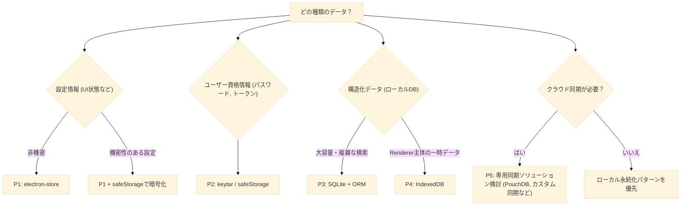
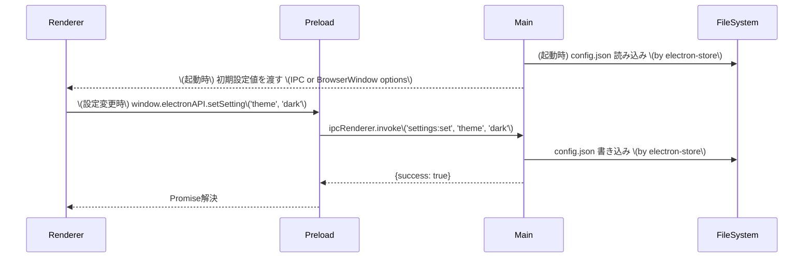
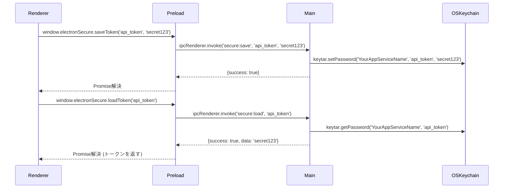
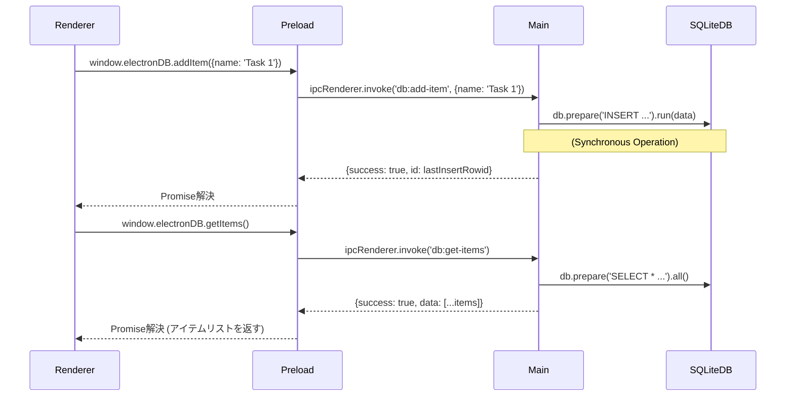

<!-- LLM-TIPS: * Update changelog with o3 with search tool. -->

# Electronデータ永続化戦略

## 1. 導入/概要

このドキュメントは、Electronアプリケーションにおけるデータ永続化の選択肢とベストプラクティスについて、包括的な指針を提供します。
主に **Electronアプリケーション開発者および実装を担当するAI Agent** を対象としています。

データの種類、セキュリティ要件、パフォーマンス、将来の運用（同期・移行など）を考慮し、最適な永続化手段を選択・実装できるようになることを目指します。具体的には、以下の点を理解できるようになります。

- 様々なデータ永続化の選択肢（Key-Valueストア、セキュアストレージ、構造化データベース、ブラウザAPIなど）。
- 各選択肢のメリット・デメリット、および選定基準。
- 一般的な実装パターンと、Electronのプロセスモデル（Main プロセス, Preload プロセス, Renderer プロセス）におけるデータの流れ。
- セキュリティ、パフォーマンス、データ移行に関する重要な考慮事項とベストプラクティス。
- 2024-2025年における関連技術のアップデートと注意点。

---

## 2. 前提知識

このドキュメントとサンプルコードを最大限に活用するには、以下の基礎知識が必要です。

- **分類: Electron基本**
  - **トピック/技術:** プロセスモデル (Main, Renderer, Preload)
    - 説明: Electronアプリケーションの基本的な動作構造。
    - 参考リンク: [Electron Docs](https://www.electronjs.org/docs/latest/tutorial/process-model)
  - **トピック/技術:** IPC (プロセス間通信)
    - 説明: 各プロセス間でデータを安全にやり取りする仕組み。
    - 参考リンク: [Electron Docs](https://www.electronjs.org/docs/latest/tutorial/ipc)
- **分類: JavaScript/Node.js**
  - **トピック/技術:** 非同期処理 (Promise, async/await)
    - 説明: Node.js環境でのノンブロッキングI/Oの基本。
    - 参考リンク: [MDN](https://developer.mozilla.org/ja/docs/Web/JavaScript/Reference/Global_Objects/Promise)
- **分類: データ形式**
  - **トピック/技術:** JSON
    - 説明: データ交換形式として広く利用される。
    - 参考リンク: [MDN](https://developer.mozilla.org/ja/docs/Web/JavaScript/Reference/Global_Objects/JSON)
- **分類: データベース一般**
  - **トピック/技術:** RDB (リレーショナルデータベース) / NoSQL の基本概念
    - 説明: (SQLiteなどを利用する場合) データベースの基本的な考え方。
    - 参考リンク: -

---

## 3. 利用するライブラリ

Electronアプリケーションで利用可能な主なデータ永続化オプションと、それに関連するライブラリ/APIを紹介します。

### 3.1. 推奨されるライブラリ/API

- **オプション分類: Key-Valueストア**
  - ライブラリ/API: `electron-store`
  - npm パッケージ: `electron-store`
  - 役割・特徴: 設定情報や小規模データのJSONファイル保存。スキーマ検証、マイグレーション機能。Electronの`userData`パスに保存。
  - 推奨/最新バージョン (2025年5月時点): `v10.x`
    - v9 以降は **完全 ESM** 化され、Node.js 20 LTS と Electron 30 以降が必須
- **オプション分類: セキュアストレージ**
  - ライブラリ/API: `safeStorage` (Electron組込み)
  - npm パッケージ: -
  - 役割・特徴: OSの機能を利用して文字列を暗号化・復号。アクセストークンなどの小規模な機密情報向け。
  - 推奨/最新バージョン (2025年5月時点): Electron API
- **オプション分類: セキュアストレージ**
  - ライブラリ/API: `keytar`
  - npm パッケージ: `keytar`
  - 役割・特徴: OSのキーチェーン/認証情報ストレージへ直接アクセス。パスワードやOAuthリフレッシュトークンなど、よりセキュアな情報向け。
  - 推奨/最新バージョン (2025年5月時点): `^7.9.0`
- **オプション分類: 構造化データベース**
  - ライブラリ/API: `better-sqlite3`
  - npm パッケージ: `better-sqlite3`
  - 役割・特徴: 軽量なファイルベースSQLデータベース。同期APIだが高速。MainプロセスまたはWorker Threadでの利用推奨。
  - 推奨/最新バージョン (2025年5月時点): `^11.x` (最新 11.9.x は SQLite 3.47 / Node‑API 11 対応)
- **オプション分類: ORM (SQLite用)**
  - ライブラリ/API: `prisma`
  - npm パッケージ: `prisma`, `@prisma/client`
  - 役割・特徴: 型安全なORM。SQLite対応。マイグレーション機能。
  - 推奨/最新バージョン (2025年5月時点): `^5.x`
- **オプション分類: ORM (SQLite用)**
  - ライブラリ/API: `typeorm`
  - npm パッケージ: `typeorm`, `sqlite3` (または `better-sqlite3`)
  - 役割・特徴: 多様なDBに対応するORM。SQLite対応。マイグレーション機能。
  - 推奨/最新バージョン (2025年5月時点): `^0.3.x`
- **オプション分類: ブラウザAPI**
  - ライブラリ/API: `IndexedDB`
  - npm パッケージ: -
  - 役割・特徴: Rendererプロセス内で利用可能なNoSQLデータベース。比較的大きな構造化データを非同期に保存可能。
  - 推奨/最新バージョン (2025年5月時点): Browser API
- **オプション分類: ブラウザAPI**
  - ライブラリ/API: `localStorage` / `sessionStorage`
  - npm パッケージ: -
  - 役割・特徴: Rendererプロセス内で利用可能なシンプルなKey-Valueストア。同期API。小規模データ、揮発性データ向け。
  - 推奨/最新バージョン (2025年5月時点): Browser API

### 3.2. 利用に注意が必要なアプローチ・非推奨

- **アプローチ/ライブラリ: `conf` / `lowdb`**
  - 理由・注意点: 汎用Node.jsライブラリであり、Electron固有の`userData`パス管理などがない。`electron-store`の方がElectron開発では一般的に推奨される。
  - 代替案/推奨: `electron-store`
- **アプローチ/ライブラリ: `localStorage`の多用**
  - 理由・注意点: 同期APIであり、大量の書き込みはUIをブロックする可能性。容量制限も厳しめ (通常5-10MB)。重要なデータの保存には不向き。
  - 代替案/推奨: `IndexedDB` (非同期), `electron-store` (Mainプロセス管理), SQLite
- **アプローチ/ライブラリ: `safeStorage` の限界**
  - 理由・注意点: macOS で safeStorage を初めて呼び出す際に Keychain アクセス許可ダイアログが表示される（Electron 19 以降で仕様上存在）。Electron 30 時点でも継続。また、あくまで同一アプリ内での暗号化・復号が主目的であり、OSレベルでの強力な保護を求めるなら`keytar`が優れる。
  - 代替案/推奨: `keytar` (より高度なセキュリティ要件の場合), 事前説明によるユーザー体験への配慮。

---

## 4. ディレクトリ構造

永続化データは通常、Electronが提供する `app.getPath('userData')` で取得できるディレクトリ以下に保存されます。

```bash
[userData]/                        # app.getPath('userData') が指すパス
├── config.json                 # electron-store のデフォルト保存ファイル
├── yourAppName.sqlite          # SQLiteデータベースファイル (例)
├── secureCredentials/          # keytarや自前の暗号化ファイル用 (構造は任意)
├── logs/                       # アプリケーションログ (永続化の一環として考慮)
│   └── app.log
└── ...                         # その他のキャッシュファイルなど
```

- `[userData]` はOSによってパスが異なります (例: Windows: `C:\Users\<username>\AppData\Roaming\<YourAppName>`, macOS: `~/Library/Application Support/<YourAppName>`)。
- `electron-store` や SQLiteライブラリは、指定がなければこの `userData` 配下にファイルを自動的に作成・管理します。

---

## 5. 実装のパターン

アプリケーションで扱うデータの種類や要件に応じて、最適な永続化手段を選択する必要があります。

- **パターンID: P1**
  - データ種類: アプリ設定、UI状態、小規模キャッシュ
  - 主な特徴・要件: ユーザー固有の設定、ウィンドウサイズ、最後に開いたファイルなど。頻繁な読み書きは少ない。
  - 推奨される永続化手段: `electron-store`
- **パターンID: P2**
  - データ種類: 機密情報 (トークン、APIキー)
  - 主な特徴・要件: OAuthトークン、APIシークレットキー、ユーザーパスワードなど。高いセキュリティが求められる。
  - 推奨される永続化手段: `keytar` (最推奨), `safeStorage` (代替・注意点あり)
- **パターンID: P3**
  - データ種類: 大量・複雑な構造化データ
  - 主な特徴・要件: 顧客DB、商品カタログ、ログ履歴など。検索、ソート、集計が必要。オフライン利用が主。
  - 推奨される永続化手段: SQLite (`better-sqlite3`) + ORM (`prisma`, `typeorm`)
- **パターンID: P4**
  - データ種類: Rendererプロセスの一時データ
  - 主な特徴・要件: Renderer内で完結する一時的な状態、キャッシュ。メインプロセスとの連携が少ない。
  - 推奨される永続化手段: `IndexedDB` (構造化データ), `sessionStorage` (揮発性)
- **パターンID: P5**
  - データ種類: マルチデバイスデータ同期
  - 主な特徴・要件: 複数のデバイスで同じデータを利用・編集したい。オフライン対応も考慮。
  - 推奨される永続化手段: PouchDB+CouchDB, SQLiteベースのカスタム同期, クラウドストレージ

パターン選択フロー (主にローカル永続化):



_上記フローは簡略化したものです。実際の選定では、パフォーマンス要件、開発コスト、チームのスキルセットなども考慮してください。_

---

## 6. 実装詳細

### 6.1. パターン P1 — `electron-store` による設定情報の永続化

#### 6.1.1. データフロー

ユーザーがRendererプロセスで設定を変更すると、その情報がIPC経由でMainプロセスに伝えられ、`electron-store` によってファイルに保存されます。アプリケーション起動時には、Mainプロセスが保存された設定を読み込み、必要に応じてRendererプロセスに渡します。



#### 6.1.2. コード提案の方針

このパターンでは、Mainプロセスで `electron-store` を初期化し、設定の読み書きを行うIPCハンドラを準備します。Preloadスクリプトはこれらのハンドラを呼び出すためのAPIをRendererプロセスに公開します。Rendererプロセスは公開されたAPIを通じて設定の読み書きを行います。具体的な実装は、上記のデータフロー図および下記のエラーハンドリング・ベストプラクティスを参考にLLMが生成します。

#### 6.1.3. エラーハンドリング & ベストプラクティス

- **スキーマ検証:** `electron-store` はJSON Schemaを利用したスキーマ検証をサポートしています。予期しない形式のデータが保存されるのを防ぐために活用しましょう。
- **マイグレーション:** アプリケーションのバージョンアップで設定の構造が変わる場合、`migrations` オプションで古い設定を新しい形式に移行できます。
- **パフォーマンス:** `electron-store` は同期的にファイルI/Oを行いますが、設定ファイルは通常小さいため問題になりにくいです。しかし、非常に大きなJSONを頻繁に読み書きするのは避けてください。
- **ファイル破損リスク:** JSONファイルは、書き込み途中でクラッシュすると破損する可能性があります。`electron-store` はアトミックな書き込みを行うことでこのリスクを軽減しています。
- **2025年の動向:** `electron-store` v10でES Modulesが正式サポートされ、暗号化キー生成ロジックが刷新されました。`encryptionKey` オプションで設定ファイル全体を暗号化できますが、キー管理には注意が必要です（`safeStorage` との組み合わせも検討）。

### 6.2. パターン P2 — `keytar` による機密情報の安全な保存

(`safeStorage` も選択肢ですが、macOSでのダイアログ問題やより強固な保護を考慮し、ここでは `keytar` をメインに解説します。)

#### 6.2.1. データフロー

Rendererプロセスから渡された機密情報（例: APIトークン）は、IPC経由でMainプロセスに送られ、`keytar` を通じてOSのキーチェーンに安全に保存されます。読み出しも同様のフローです。



#### 6.2.2. コード提案の方針

このパターンでは、Mainプロセスで `keytar` を利用してOSのキーチェーンにアクセスし、機密情報の保存・読み出し・削除を行うIPCハンドラを定義します。Preloadスクリプトはこれらの機能をRendererプロセスにAPIとして提供します。Rendererプロセスは、このAPIを通じて安全に機密情報を扱います。具体的な実装は、上記のデータフロー図および下記のエラーハンドリング・ベストプラクティスを参考にLLMが生成します。

#### 6.2.3. エラーハンドリング & ベストプラクティス

- **ネイティブ依存:** `keytar` はネイティブモジュールであり、`electron-rebuild` を使ってElectronのバージョンに合わせて再ビルドが必要です。CI/CDパイプラインに組み込むことを推奨します。
- **サービス名とアカウント名:** `keytar.setPassword(service, account, password)` の `service` と `account` (コード例では `key`) は慎重に選び、アプリ全体で一貫性を持たせます。
- **エラー処理:** キーが存在しない場合、`getPassword` は `null` を返します。アクセス権限がない場合などはエラーをスローすることがあるため、適切な `try...catch` が必要です。
- **`safeStorage` との比較:**
  - `safeStorage`: Electron組込みで追加依存なし。暗号化/復号のみ。macOSで初回ダイアログ問題 (Electron 28+)。
  - `keytar`: OS標準のキーチェーン利用でより堅牢。ネイティブ依存とビルドが必要。
    機密性が非常に高い情報や、OSレベルでの管理が望ましい場合は `keytar` を推奨。

### 6.3. パターン P3 — `better-sqlite3` による構造化データの保存

#### 6.3.1. データフロー

`better-sqlite3` は同期APIのため、Mainプロセスまたは専用のWorker Threadで操作します。Rendererプロセスからのデータ操作リクエストはIPC経由でMainプロセスに送られ、MainプロセスがSQLiteデータベースを操作します。



#### 6.3.2. コード提案の方針

このパターンでは、Mainプロセスで `better-sqlite3` を用いてSQLiteデータベースへの接続を確立し、テーブル作成やデータのCRUD操作を行うIPCハンドラを実装します。Preloadスクリプトがこれらの操作をラップしたAPIをRendererプロセスに提供します。Rendererプロセスは、このAPIを介して構造化データを扱います。パフォーマンスを考慮し、重いDB操作はWorker Threadで行うことも検討します。具体的な実装は、上記のデータフロー図および下記のエラーハンドリング・ベストプラクティスを参考にLLMが生成します。

#### 6.3.3. エラーハンドリング & ベストプラクティス

- **同期API注意:** `better-sqlite3` のAPIは同期的です。複雑なクエリや大量のデータ操作はMainプロセスをブロックし、UIの応答性を損なう可能性があります。対策として、`worker_threads` を利用してデータベース操作を別スレッドで行うことを強く推奨します。
- **ORMの利用:** 大規模なアプリケーションでは、prismaやtypeormのようなORMを利用することで、型安全性、マイグレーション管理、複雑なクエリの抽象化といったメリットが得られます。ただし、ビルドプロセスやネイティブ依存関係が複雑になる場合があります。
- **データベースファイルのパス:** `app.getPath('userData')` を使用して、OSごとの適切な場所にデータベースファイルを保存します。
- **マイグレーション:** スキーマの変更は手動またはORMのマイグレーション機能を利用して管理します。`PRAGMA user_version` を使ってスキーマバージョンを管理する手法もあります。
- **バックアップ:** 定期的なデータベースファイルのバックアップ戦略を検討してください（例: アプリ終了時にコピーを作成）。
- **暗号化:** 機密データが含まれる場合、SQLCipher (better-sqlite3は直接サポートしていないが、`@capacitor-community/sqlite`などが対応) やファイルシステムレベルの暗号化を検討します。
- **Node 20 LTS と File System Access API:** Node 20で安定した `fs/promises` や実験的なFile System Access API (Origin Private File System) が利用可能になりましたが、SQLiteのような構造化DBとは直接的な関連は薄いです。大容量ファイルの扱いで役立つ可能性があります。

#### 6.4. 考慮すべき最近の変更点 (2024-2025年)

- **`electron-store` v10 (2025年1月～):**
  - ESM正式サポート。`import` 形式への移行。
  - デフォルトの暗号化アルゴリズム更新、`encryptionKey` 生成ロジック刷新。古いバージョンからアップグレードする際は、暗号化キーのマイグレーションが必要になる場合があります。
- **`safeStorage` (Electron 28+):**
  - macOSで初回利用時にキーチェーンアクセス許可のパスワードプロンプトが表示される問題が報告されています。ユーザー体験への影響を考慮し、代替として `keytar` を検討するか、ユーザーへの事前説明を行う必要があります。
- **Node.js 20 LTS の採用 (Electron 29+):**
  - `fs/promises` APIが安定し、非同期ファイル操作がより簡潔に記述可能になりました。
- **(参考) `Zutron` (Zustandベースストア, 2025年4月登場のライブラリ例):**
  - Zustand (状態管理) と Electron IPC を抽象化するライブラリが登場するなど、コミュニティではプロセス間での状態同期を簡略化する試みが続けられています。特定の状態管理ライブラリに依存する場合があります。
