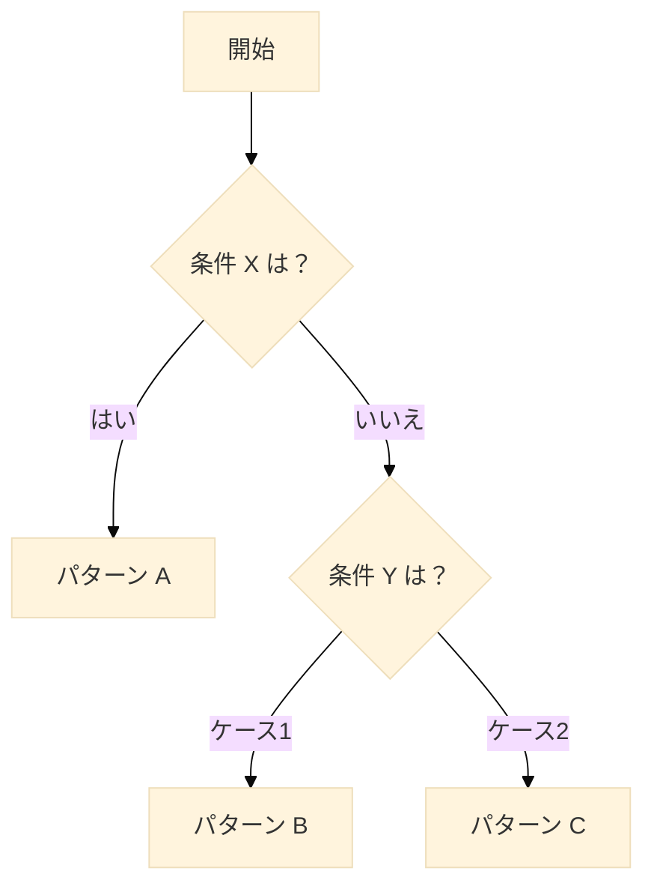
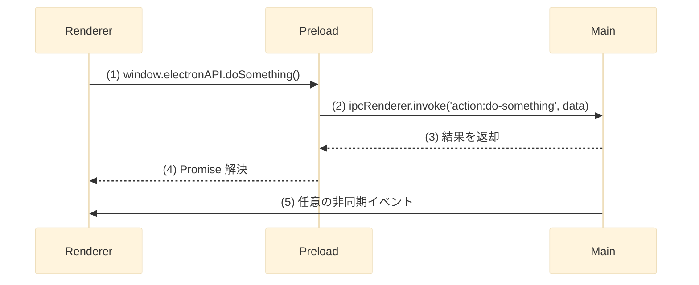

## 0. ドキュメントスタイルガイド（必読）

- **タイトル形式**: `Electron` + 日本語名（半角スペースを挟まない）。例: **Electronデータ永続化戦略**
- **ハイフン & 小文字**: 用語に使うハイフンは ASCII `-`。lower-case 表記を徹底。例: `typed-ipc`, `electron-store`, `end-to-end`
- **プロセス列挙**: `Main プロセス, Preload プロセス, Renderer プロセス`（カンマ + 半角スペース区切り）
- **npm ライブラリ名の装飾**: すべてバッククオート `` `library-name` `` で囲む
- **Markdown レイアウト**: 原則として表は使用せず、箇条書きを推奨
- **第3章の見出し名**: 必ず「利用するライブラリ」

# (ここにタイトルを記述)

## 1. 導入/概要

このドキュメントは、(対象技術や機能) に関する (目的やゴール) を達成するための指針を提供します。  
主に **(対象読者、例: Electron アプリ開発者、AI Agent)** を対象としています。

本書を読むことで、以下を理解し実装できるようになることを目指します。

- (達成可能なこと 1)
- (達成可能なこと 2)
- (達成可能なこと 3)

## 2. 前提知識

このドキュメントとサンプルコードを最大限に活用するには、以下の基礎知識が必要です。

- **分類: 主要ライブラリ**
  - **ライブラリ／ツール:** `ライブラリ名1` — (簡潔な説明)
    - 参考リンク: GitHub https://github.com/… / DeepWiki https://deepwiki.com/…
  - **ライブラリ／ツール:** `ライブラリ名2` — (簡潔な説明)
    - 参考リンク: GitHub https://github.com/…
- **分類: 実装言語**

  - **言語:** TypeScript — 型安全な JavaScript のスーパーセット
    - 参考リンク: https://www.typescriptlang.org/

- **分類: データバリデーション**
  - **ライブラリ／ツール:** `zod` — スキーマ定義と実行時バリデーションを TypeScript で両立
    - 参考リンク: <https://zod.dev>

## 3. 利用するライブラリ

### 3.1. 利用可能ライブラリ

- `typed-ipc`
  - npm パッケージ: `typed-ipc`
  - 役割: 型安全な IPC 通信の実現
  - 選定理由: TypeScript と親和性が高い
  - 推奨バージョン: ^2.0.0
- `zod`
  - npm パッケージ: `zod`
  - 役割: スキーマ定義 & 実行時バリデーション
  - 選定理由: tRPC と相性が良く、型推論が強力
  - 推奨バージョン: ^3.x

### 3.2. 利用不可ライブラリ

- `ライブラリ名X`
  - 理由: (非推奨・メンテ停止 等)
  - 代替案: ライブラリ名A
- `ライブラリ名Y`
  - 理由: (本プロジェクト方針と不一致)
  - 代替案: ライブラリ名B

## 4. ディレクトリ構造

```text
project-root/
├── src/
│   ├── main/               # Main プロセス
│   ├── preload/            # Preload スクリプト
│   ├── renderer/           # フロントエンド (React など)
│   └── shared/             # 共通型・ユーティリティ
├── locales/                # i18n ファイル
├── docs/                   # ドキュメント
│   ├── adr/                # アーキテクチャ決定記録
│   ├── research/           # 技術調査ドキュメント
│   ├── guides/             # 開発ガイド
│   └── README.md           # ドキュメント概要
└── package.json
```

## 5. 実装のパターン

- **パターン A**
  - 概要: (名称)
  - メリット: (利点)
  - デメリット: (欠点)
- **パターン B**
  - 概要: (名称)
  - メリット: (利点)
  - デメリット: (欠点)
- **パターン C**
  - 概要: (名称)
  - メリット: (利点)
  - デメリット: (欠点)

パターン選択フロー:



## 6. 実装詳細

### 6.1. パターン A — (名称)

#### 6.1.1. データフロー



#### 6.1.2. エラーハンドリング & ベストプラクティス

- `ipcMain.handle` 内で `try/catch` を徹底し、エラー情報を構造化して返却する。
- Renderer 側は `success` フラグを確認し UI に反映。
- `contextBridge` で公開する API は最小限に。
- 重い処理は `worker_threads` や external プロセスで非同期化。

### 6.2. パターン B — (名称)

(必要に応じて同様の小節を追加)

## 7. ドキュメント間の参照方法

- 同一リポジトリ内リンク: `@docs/research/storage.md`
- セクション指定: `@docs/research/config.md#5-状態の永続化`
- コード参照: `@src/main/index.ts:42`
- ADR参照: `@docs/adr/0002-trpc-over-ipc.md`
